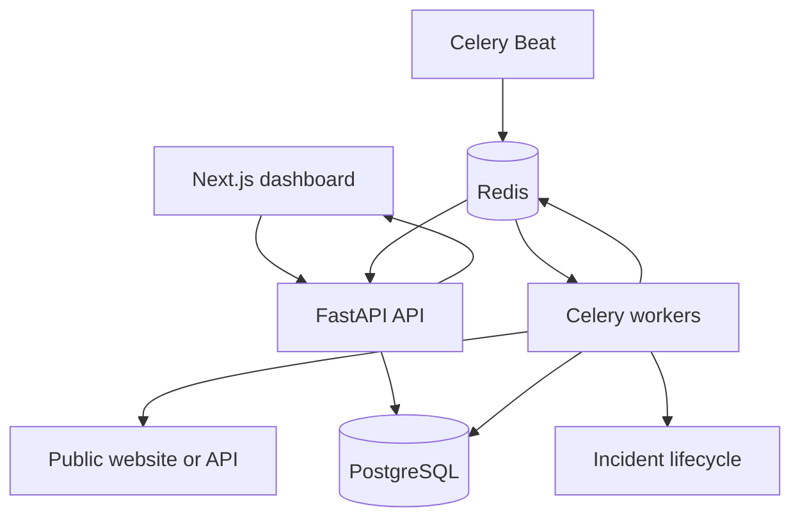

# PulseWatch

PulseWatch is a full-stack cloud observability and incident-management platform for public websites and APIs. It schedules health checks, measures service reliability, stores latency history, and automatically tracks failures and recoveries.

## Current MVP

- Create, update, pause, delete, and manually check HTTP monitors
- Scheduled GET or HEAD checks with configurable intervals and expected status codes
- PostgreSQL check history with latency, response status, and failure details
- Redis-backed Celery worker and scheduler
- Automatic incident creation and recovery tracking
- Rolling 24-hour uptime, average latency, and P95 latency metrics
- Redis pub/sub and a WebSocket event stream
- Responsive Next.js operations dashboard
- Docker Compose stack for the API, dashboard, PostgreSQL, Redis, worker, and scheduler
- Basic blocking of localhost, private IP, and reserved IP monitoring targets

## Architecture



## Run locally with Docker

1. Create the environment file:

   ```bash
   cp .env.example .env
   ```

2. Set a strong PostgreSQL password in `.env`.

3. Start the stack:

   ```bash
   docker compose up --build
   ```

4. Open:

   - Dashboard: `http://localhost:3001`
   - API documentation: `http://localhost:8000/docs`
   - API health: `http://localhost:8000/health`

## API routes

| Method | Route | Purpose |
| --- | --- | --- |
| `GET` | `/health` | API health check |
| `GET` | `/api/endpoints` | List monitors with their latest result |
| `POST` | `/api/endpoints` | Create a monitor |
| `PATCH` | `/api/endpoints/{id}` | Update or pause a monitor |
| `DELETE` | `/api/endpoints/{id}` | Delete a monitor and its history |
| `POST` | `/api/endpoints/{id}/check` | Run an immediate check |
| `GET` | `/api/endpoints/{id}/checks` | Read recent check history |
| `GET` | `/api/endpoints/{id}/metrics` | Calculate rolling uptime and latency metrics |
| `GET` | `/api/incidents` | Read the failure and recovery timeline |
| `GET` | `/api/dashboard/summary` | Read dashboard totals and average latency |
| `WS` | `/ws/checks` | Receive live check events |

## Repository layout

```text
pulsewatch/
├── backend/          FastAPI, SQLAlchemy, Celery, monitoring services
├── frontend/         Next.js dashboard
├── docker-compose.yml
└── .env.example
```

## Next milestones

- User accounts and per-user monitor ownership
- Alembic migrations
- Incident acknowledgement and maintenance windows
- Interactive latency charts for 24-hour, 7-day, and 30-day periods
- Email and generic webhook notification channels
- DNS resolution checks to close hostname-based SSRF edge cases
- GitHub Actions build and deployment workflow
