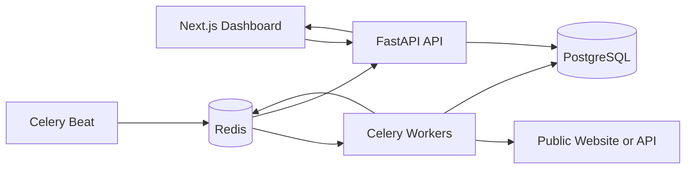

<div align="center">

# PulseWatch

### Cloud Observability and Incident Management Platform

Monitor public websites and APIs, measure service reliability, and track incidents from a focused operations dashboard.

[](https://nextjs.org/)
[](https://fastapi.tiangolo.com/)
[](https://www.python.org/)
[](https://www.postgresql.org/)
[](https://www.docker.com/)
[](https://github.com/Adityagithubhack/pulsewatch/actions/workflows/ci.yml)

</div>

## Overview

PulseWatch is a full-stack observability platform that performs scheduled health checks against public HTTP services. It records response status and latency, calculates rolling reliability metrics, and automatically opens or resolves incidents when service state changes.

The project uses asynchronous API handlers, background task processing, persistent check history, Redis event distribution, and a responsive operational dashboard.

## Features

- Configurable `GET` and `HEAD` monitors for public websites and APIs
- Automated health checks using Celery workers and Celery Beat
- Live service state, HTTP response code, and latency monitoring
- Rolling 24-hour uptime, average latency, and P95 latency metrics
- Automatic incident creation when a service fails
- Automatic incident resolution when the service recovers
- Searchable check history stored in PostgreSQL
- Redis pub/sub event distribution and WebSocket streaming
- Responsive Next.js operations dashboard
- URL validation that blocks localhost, private IP, and reserved IP targets
- Containerized local environment with Docker Compose

## System Architecture



### Monitoring flow

1. Celery Beat scans for monitors whose check interval has elapsed.
2. Redis queues a monitoring task for each due endpoint.
3. A Celery worker performs the HTTP request and measures latency.
4. The result is persisted in PostgreSQL.
5. A state transition from `up` to `down` opens an incident.
6. A transition from `down` to `up` resolves the active incident.
7. Redis publishes the new result for real-time consumers.

## Technology Stack

| Layer | Technologies |
| --- | --- |
| Frontend | Next.js 16, React 19, TypeScript, CSS |
| API | FastAPI, Pydantic, Uvicorn |
| Data | PostgreSQL 16, SQLAlchemy 2, asyncpg |
| Background processing | Celery, Celery Beat, Redis |
| Real-time events | Redis Pub/Sub, WebSockets |
| HTTP monitoring | HTTPX |
| Infrastructure | Docker, Docker Compose |
| Quality | Pytest, Ruff, TypeScript compiler, npm audit |

## Quick Start

### Requirements

- Docker Desktop
- Docker Compose
- Git

### 1. Clone the repository

```bash
git clone https://github.com/Adityagithubhack/pulsewatch.git
cd pulsewatch
```

### 2. Configure the environment

```bash
cp .env.example .env
```

For local development, the provided defaults work without additional services. Change the PostgreSQL password before deploying publicly.

### 3. Start PulseWatch

```bash
docker compose up -d --build
```

### 4. Open the application

- Dashboard: [http://localhost:3001](http://localhost:3001)
- API documentation: [http://localhost:8000/docs](http://localhost:8000/docs)
- API health: [http://localhost:8000/health](http://localhost:8000/health)

### 5. Check service status

```bash
docker compose ps
```

All six services should be running, with PostgreSQL and Redis reporting healthy.

## Configuration

| Variable | Purpose | Default |
| --- | --- | --- |
| `POSTGRES_DB` | PostgreSQL database name | `pulsewatch` |
| `POSTGRES_USER` | PostgreSQL username | `pulsewatch` |
| `POSTGRES_PASSWORD` | PostgreSQL password | `change-me` |
| `DATABASE_URL` | Async SQLAlchemy connection URL | PostgreSQL container URL |
| `REDIS_URL` | Celery broker, result backend, and pub/sub URL | `redis://redis:6379/0` |
| `NEXT_PUBLIC_API_URL` | Browser-accessible FastAPI base URL | `http://localhost:8000` |
| `FRONTEND_ORIGIN` | Allowed dashboard origin for CORS | `http://localhost:3001` |

## API Reference

| Method | Route | Purpose |
| --- | --- | --- |
| `GET` | `/health` | Check API availability |
| `GET` | `/api/endpoints` | List monitors with their latest check |
| `POST` | `/api/endpoints` | Create a new monitor |
| `GET` | `/api/endpoints/{id}` | Read one monitor |
| `PATCH` | `/api/endpoints/{id}` | Update or pause a monitor |
| `DELETE` | `/api/endpoints/{id}` | Delete a monitor and its history |
| `POST` | `/api/endpoints/{id}/check` | Run an immediate health check |
| `GET` | `/api/endpoints/{id}/checks` | Read recent check history |
| `GET` | `/api/endpoints/{id}/metrics` | Calculate rolling uptime and latency metrics |
| `GET` | `/api/incidents` | Read the incident and recovery timeline |
| `GET` | `/api/dashboard/summary` | Read operational dashboard totals |
| `WS` | `/ws/checks` | Stream live monitoring results |

Interactive OpenAPI documentation is available at `/docs` while the API is running.

## Validation and Tests

### Backend

```bash
cd backend
python3 -m venv .venv
source .venv/bin/activate
pip install -r requirements-dev.txt
ruff check app tests
pytest -q
```

### Frontend

```bash
cd frontend
npm install
npm run build
npm audit --omit=dev
```

Current verification status:

- Backend lint passes
- URL safety tests pass
- Next.js production build passes
- TypeScript validation passes
- Production dependency audit reports zero known vulnerabilities

## Continuous Integration and Deployment

The GitHub Actions pipeline validates every push and pull request by running:

- Ruff backend linting
- Pytest backend tests
- Next.js production build and TypeScript validation
- Production dependency audit
- Docker Compose image builds

A separate guarded workflow can deploy successful `main` builds to a DigitalOcean server through SSH. Deployment stays disabled until the required secrets and the `ENABLE_DEPLOY` repository variable are configured.

See [DigitalOcean Deployment](docs/DEPLOYMENT.md) for the complete server and GitHub configuration.

## Project Structure

```text
pulsewatch/
├── backend/
│   ├── app/
│   │   ├── api/             HTTP routes
│   │   ├── core/            Configuration and database setup
│   │   ├── services/        Probing, checks, metrics, and URL validation
│   │   ├── main.py          FastAPI application and WebSocket stream
│   │   ├── models.py        SQLAlchemy models
│   │   ├── schemas.py       Pydantic request and response schemas
│   │   └── worker.py        Celery tasks and scheduler
│   └── tests/
├── frontend/
│   ├── app/                 Next.js App Router
│   ├── components/          Dashboard UI
│   └── lib/                 API client and TypeScript models
├── .github/workflows/   CI and guarded deployment workflows
├── docs/                Deployment documentation
├── docker-compose.yml
└── .env.example
```

## Roadmap

- Authentication and per-user monitor ownership
- Team workspaces and role-based access control
- Interactive 24-hour, 7-day, and 30-day latency charts
- Incident acknowledgement, notes, and maintenance windows
- Public status pages for monitored services
- Email and generic webhook notification channels
- SSL certificate and domain-expiration monitoring
- Alembic database migrations
- GitHub Actions CI/CD and cloud deployment
- DNS resolution checks for stronger SSRF protection

## Author

**Aditya Singh**

- GitHub: [@Adityagithubhack](https://github.com/Adityagithubhack)
